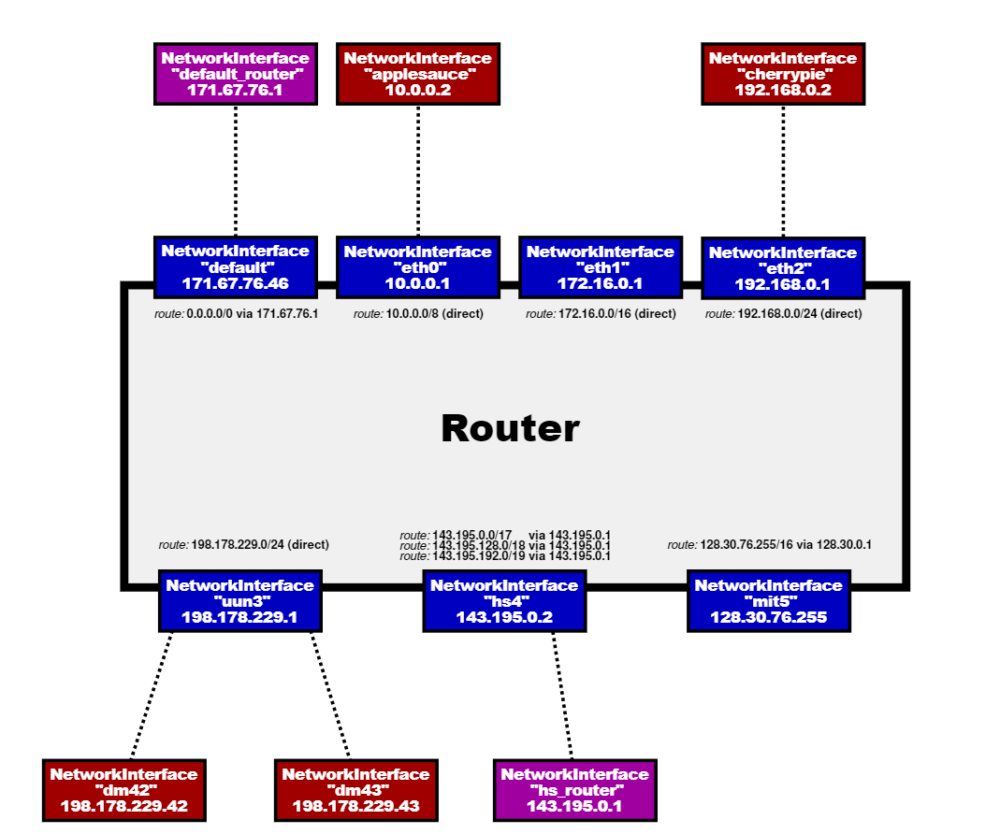
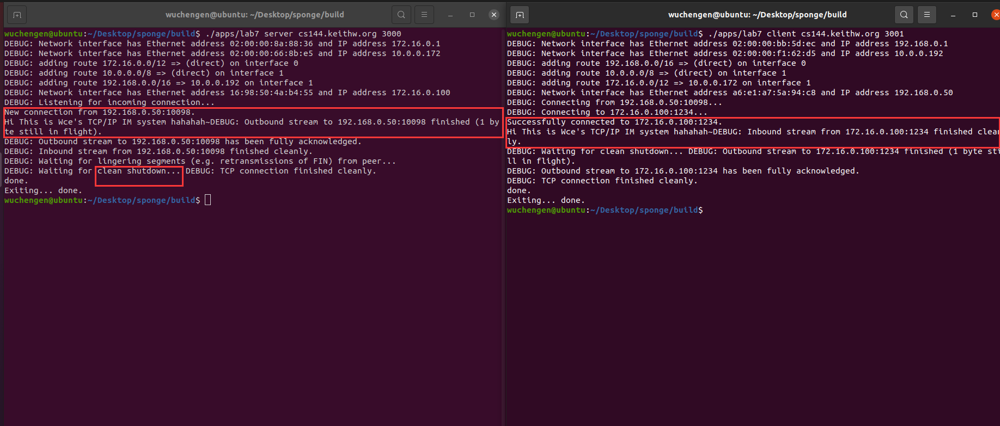

# Lab6（the router）


要结尾啦，这是最后一个lab，总算在自己规定的ttl内完成了所有的lab（小开心一下），本次的lab，是让在lab5网络接口的基础上完成路由转发和查找的一些内容，有点像lab1和2的resemble和receiver，实验帮我们已经构建好network的子类：异步网络接口类，我们只需要在router内调用即可。




这里的网络接口就是每一个网卡的接口，一个路由有多个网卡用来打出帧，每个路由内存放的路由表来规定每一个网络接口将会去往的目的地。


## 2.实现

 

本次实验相对来说比较简单的，简单来说是一个查找和存储的算法，我没有用什么特殊的查找算法，就用的时间复杂度位O(n)的循环查找。然而实验的难点在于理解如何判断是否为需要查找的点。

我们知道IP地址是一串二进制数，所以我们需要去对比每一位，所以我们这里运用到了 **&** 运算符，对每一位取和，然而这是不够的，我们还需要掩码来规定要对比的位数，这里也就是文档里提到的前缀长度，我们需要对比的是前缀，比如18.64.0.0/16这里的前缀就是18.64，前缀长度为16位，这里我们就需要对IP取高len位与路由表里的前缀对比即可。


```c++
    struct router_table 
    {
        uint32_t route_prefix=0;
        uint8_t prefix_length=0;
        std::optional<Address> next_hop=std::nullopt;
        size_t interface_num=0;
    };
    std::vector<router_table> router_list{};
```

上面我们自己需要添加的数据结构。


```c++
void Router::add_route(const uint32_t route_prefix,
                       const uint8_t prefix_length,
                       const optional<Address> next_hop,
                       const size_t interface_num) {
    cerr << "DEBUG: adding route " << Address::from_ipv4_numeric(route_prefix).ip() << "/" << int(prefix_length)
         << " => " << (next_hop.has_value() ? next_hop->ip() : "(direct)") << " on interface " << interface_num << "\n";

    DUMMY_CODE(route_prefix, prefix_length, next_hop, interface_num);
    router_list.push_back(router_table{route_prefix,prefix_length,next_hop,interface_num});
    // Your code here.
}

//! \param[in] dgram The datagram to be routed
void Router::route_one_datagram(InternetDatagram &dgram) {
    DUMMY_CODE(dgram);
    // Your code here.
    const uint32_t dst=dgram.header().dst;
    bool is_found=false;
    //start search
    auto rt = router_list.end();
    for(auto it=router_list.begin();it!=router_list.end();it++){
        //看是是否为0或者取dst和前缀的高length位
        //uint32_t offset = (it->prefix_length == 0) ? 0 : 0xffffffff << (32 - it->prefix_length);
        
        if(it->prefix_length==0||(it->route_prefix ^ dst)>>(32-it->prefix_length)==0){
            //取有效位最多的，更新一下
            
            if(!is_found||rt->prefix_length<it->prefix_length){
                is_found=true;
                rt=it;
            }
        }
    }
    if(!is_found){
        return;
    }
    if(dgram.header().ttl<=1){
        return;
    }
    dgram.header().ttl--;
    
    if(rt->next_hop.has_value()){
        _interfaces[rt->interface_num].send_datagram(dgram, rt->next_hop.value());
        
    }
    //如果为空则说明是最后一个需要的路由器，所以目的地址则是需要发送的下一跳
    else{
     _interfaces[rt->interface_num].send_datagram
         (dgram,Address::from_ipv4_numeric(dgram.header().dst));
    }


    
}
```

## Lab7（综合）

这里就是将上面所有lab进行一个总和，然后搭建出一个自己的TCP/IP 即时通讯协议。可以在自己的虚拟机开启两个终端一个当客户端一个当服务端，这里有个小问题，我先开启C再开启S才能连上（我也不知道为啥hhh）




## 总结

wow，当看到Lab7我的客户端和服务端建立连接并且可以通讯的时候，我的脑海里浮现出这2个月的点点滴滴，从海南的旅游到回到老家，再到回到学校每一天都在吸收新知识，由于我计算机网络是没有学过的，所以做的还是比较慢的，是一边上网课一边做实验的，当然也很感谢Github大佬提供的博客思路，当然我也很希望我这套思路也能够帮助到更多人，OK，再不说什么了，去开新坑了哈哈哈哈